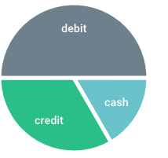
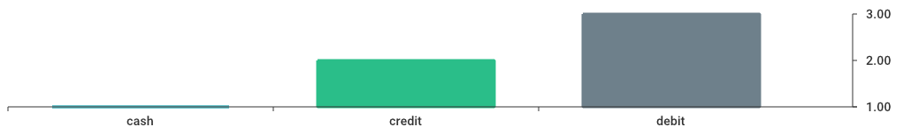
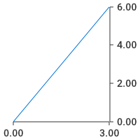

Pizzeria
=========

Pizzeria is a chart generator as a service


### Requirements

Golang 1.3+

### What is it?

The main inspiration of Pizzeria was
[Google deprecated chart api](https://developers.google.com/chart/image). 
We believe that sometimes developers need to have a simple way to generate
image charts. 
A http api could be a good tool to solve this problem.
Thank you for [wcharczuk/go-chart](https://github.com/wcharczuk/go-chart).


### How to install and run it ?

```bash
download the project to some $path
cd $path/
go run main.go
```

### Examples 

#### Pie chart

http://localhost:8080/pie?h=200&w=200&dt=1,2,3&lb=cash,credit,debit



#### Bar chart 

http://localhost:8080/bar?h=200&w=200&dt=1,2,3&lb=cash,credit,debit



### Line chart 

http://localhost:8080/line?h=200&w=200&dtx=1,2,3&dty=2,4,6



### Roadmap 

- [x] Avoid to write in a file before send as http response
- [x] Add default colors support 
- [ ] Add support to stacked bar
- [X] Add support to default ranges 
- [ ] Add support to padding
- [X] Add support to [axis labels](https://github.com/wcharczuk/go-chart/blob/master/_examples/custom_ticks/main.go)
- [ ] Add cache support


